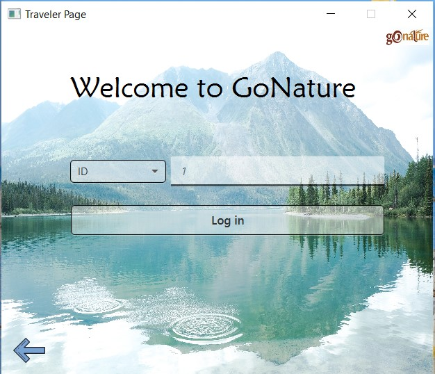
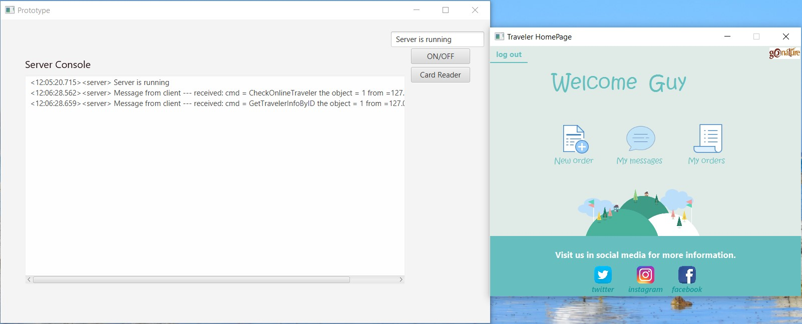

# Parks_management_sys
## Main purpose
The main purpose of this project is to implement distributed system based on client-server properties.  
The system manages all the users parallel using synchronized functions. 
The system includes comfortable UI which simplify the system's use of for any user.

## Users
Each user have specific functions he can do based on the UC diagram:  

## Some of the results

 |  
